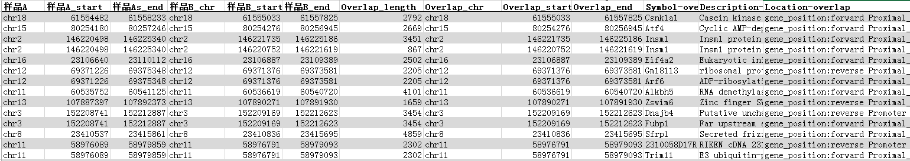

# TandemRepeatsFinder
　　Trf（Tandem Repeat Finder）是用来搜寻 DNA 序列中的串联重复序列(相临的重复两次 或者多次特定核酸序列模式的重复序列) 。重复单元可以从1bp到500bp，DNA查询序列大小可以超过5M。 
　　官网：http://tandem.bu.edu/trf/trf.html
***
#### **<i class="fa fa-dot-circle-o" aria-hidden="true" style="color:#3090C7"></i> 输入文件**
inputFile (FASTA)：输入序列，fasta格式。
***
#### **<i class="fa fa-cog" aria-hidden="true" style="color:#F88158"></i> 参数设置**
Match：匹配的权重，默认为2。
Mismatch：没有匹配的权重，默认为7。
Delta：插入删除的匹配的权重，默认为7。
匹配上的概率：匹配上的概率（PM），默认为80。
最小匹配分值：最小的匹配分值，默认为50。
最大的重复单元数：最大的重复单元bp数，默认为500bp。

***
#### **<i class="fa fa-file-text" aria-hidden="true" style="color:#848b79"></i> 结果说明**
主要查看 .summary.html文件：
.summary.html：信息统计，点击可查看记录串联重复序列信息的文件。
.dat：参数产生的屏蔽的的串联重复序列信息文件
.mask：参数产生的串联重复序列被屏蔽为Ｎ的序列文件
.html：记录每条染色体串联重复序列信息的文件
．txt.html 记录每条染色体相关串联重复序列比对信息的文件

</img>

</img>

