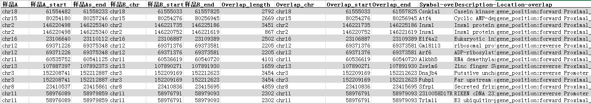

# HTSeq
　　将测序得到的reads比对到参考基因组序列上之后，得到bam文件，需要对bam文件进行统计计算，进而得到基因的表达量结果。
**功能：**
　(1) 表达量统计。
　(2) reads在每条染色体上的分布。
**使用软件：**
　　htseq-count: 一个用于处理高通量数据（High-throughout sequencing)的python包，是一款用于reads计数的软件，他能对位于基因组上的一些单位的reads数进行统计，这里所说的单位主要是指染色体上的一组位置区间（我们常见的就是gene exon）。软件官网：http://htseq.readthedocs.io/en/release_0.9.1/overview.html

**应用范围**
　　对完成参考序列比对的Reads进行计算分析，获得样品的基因表达量数据。

***
#### **<i class="glyphicon glyphicon-log-in" aria-hidden="true" style="color:#3090C7"></i> 输入文件**
　　该task数据来源文件通常是RnaSeqMap结果的Bam文件，选择默认的参数，即可输出基因的表达量表格。
　　**InputBam：**比对得到的bam文件。BAM就是SAM的二进制文件（B取自于binary）。一般情况下比对软件（如：bowtie/bowtie2 BWA）的结果文件都是Bam格式文件。SAM的全称是sequence alignment/map format。详细信息请见官网说明文档：http://samtools.github.io/hts-specs/SAMv1.pdf
　　**gtfFile：**需要分析物种的注释文件（GTF/GFF），如果该物种的基因组注释文件已经存在于物种版本数据库中则不需要输入该文件。

#### **<i class="glyphicon glyphicon-log-out" aria-hidden="true" style="color:#3090C7"></i> 输出文件**
　　基因表达量rpkm值列表和counts数列表（txt）。

***
#### **<i class="fa fa-cog" aria-hidden="true" style="color:#F88158"></i> 参数设置**
　**物种：**选择参考基因组物种。
　**物种版本：**参考基因组的版本。
　**物种类型：**同一版本的基因组数据，在不同数据库中记录的信息不同，选择不同数据库gtf文件。
　**HTSeqMode：**判断一个reads属于某个基因的模型，用来判断统计reads的时候对一些比较特殊的reads定义是否计入。该参数选项值有以下三种，union、intersection-strict、intersection-nonempty（默认值为union）。

</img>

　**StrandSpecific：**输入数据是否是来自链特异性建库（默认 yes)，该参数选项值有以下三种：
　　　Not consider strand：不考虑链特异性。
　　　Strand Specific：表示考虑链特异性，对于single-end reads，reads必须要比对到同一链上，对于paired-end reads，一端reads比对到一条链上，另一端reads比对到另外一条链上。
　　　Reverse Strand Specific：考虑链特异性，但原则与“Strand Specific”正好相反。
　**MinQuality：**指定一个最低 read mapping质量值，低于<minaqual>值会被过滤掉（默认是10，0.5.4版本以前默认值是 0）。
　**OnlyUniqueMappedReads：**仅用UniqueMappedReads计算表达量。

***
#### **<i class="fa fa-file-text" aria-hidden="true" style="color:#848b79"></i> 结果说明**
　1).HTSeq.rpkm.txt：所有基因表达量rpkm值列表，如：

</img>

　2).HTSeq.counts.txt：所有基因表达counts数列表，如：

</img>

　3).chr_distribution.png: 测序mapped reads比对到基因组上的各个染色体的密度进行统计。

</img>

　4).mapping_statistics.xls：比对统计列表。

</img>

***
#### **</i>  补充说明**
　　RPKM：Reads Per Kilobase per Million mapped reads的缩写，代表每百万reads中来自于某基因每千碱基长度的reads数。RPKM是将map到基因的read数除以map到基因组上的所有read数(以million为单位)与RNA的长度(以KB为单位)。计算公式为：

</img>

　　其中RPKM为基因表达量，C为唯一比对到该基因上reads数，N为唯一比对到参考基因上的总reads数，L为该基因编码区的碱基数。RPKM法能消除基因长度和测序量差异对计算基因表达的影响，计算得到的基因表达量可直接用于比较不同样品间的基因表达差异。如果一个基因存在多个转录本，则用该基因的最长转录本计算其测序覆盖度和表达量。

参考文献：
Anders S, Pyl PT, Huber W. HTSeq–a Python framework to work with high-throughput sequencing data. Bioinforma. Oxf. Engl. 2015;31:166–169. doi: 10.1093/bioinformatics/btu638. [PMC free article][PubMed] [Cross Ref]
