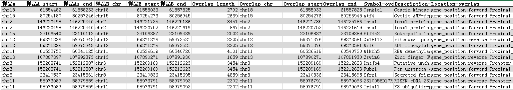

# **QuSAGE**
　  

### **工具介绍**
　  

#### **功能概述**

QuSAGE（Quantitative Set Analysis for Gene Expression, 基因表达定量集合分析），是一种定量分析基因群在不同样本中差异表达的分析方法。QuSAGE通过概率密度函数（Probability Density Function, PDF）量化被分析的基因群体的整体表达活跃程度，并通过概率密度曲线图（Probability Density Curve Plot）、置信区间图（Confidence Interval Plot）等数据可视化方式，展示被分析的基因群体的整体表达情况。
　  

#### **软件特点**

QuSAGE是用R语言开发的工具。
QuSAGE可通过PDF轻松获得相应的P-Value和置信区间。  
在计算过程中，QuSAGE通过方差膨胀因子（Variance Inflation Factor）来消除基因群内不同基因之间的相关性导致的假阳性错误。
　  
#### **软件官网**
http://clip.med.yale.edu/qusage/

　  
### **流程搭建**
　  

**上游工具**：Seurat_NormalizedForTab / SeuratFor10X_Normalized / Seurat_Cluster / Seurat_ReCluster 等
**下游工具**：ScHeatMap  
**连接示例**：

</img>

　  

### **文件传入**

　  
#### **输入文件 Input Expression Matrix File**
基因表达矩阵文件（tsv文件）（必传文件）
参数说明：
基因表达矩阵文件可以从上游工具获取（例如Seurat_NormalizedForTab / SeuratFor10X_Normalized / Seurat_ReCluster中的SelectedNormalizedCounts.txt.bz2）。基因表达矩阵（Expresssion Matrix）是qusage算法的第1个传入参数。

　  
#### **输入文件 Input CellClusterLinkFile**
细胞及类群关联列表文件（tsv文件）（必传文件）
参数说明：
细胞及类群关联列表文件可以从上游工具获取（例如Seurat_Cluster / Seurat_ReCluster中的GraphClust.Summary_Cell.txt）。细胞及类群关联列表（Cell Cluster Link List）是qusage算法的第2个传入参数。用户也可以根据需要，自定义细胞与细胞类群的关系。例如，当用户需要将细胞类群名称从原始的数字编号转换成有含义的字符串（例如Cluster 0改为B_cell），或将不同细胞类群合并（例如Cluster 0 2 3 合并为T_cell）或拆分（例如Cluster 0细分为CD4-T、CD8-T）时，都可以通过传入自定义细胞及类群关联列表文件来实现。
  　  

　  
#### **输入文件 Input GeneSetsFile (optional)**
基因集合文件（tsv文件/gmt文件）（选传文件）
参数说明：
基因集合（GeneSets）是qusage算法的第4个传入参数，可以通过tsv表格文件将基因集合数据传入工具。
tsv表格文件来源可以是其它工具的结果文件或手动生成。格式必须满足：每行前两列分别是基因集合名称和基因名称（二者是集合与所含元素的关系），表头不可缺少。例如:

    <table class="table table-striped">
				<thead>
					<tr>
<th style="text-align:center">GeneSet Name</th>
<th style="text-align:center">Gene Name</th>
</tr>

				</thead>
				<tbody>
					<tr>
<td style="text-align:center">B_cell</td>
<td style="text-align:center">CD19</td>
</tr>
<tr>
<td style="text-align:center">B_cell</td>
<td style="text-align:center">CD79</td>
</tr>
<tr>
<td style="text-align:center">T_cell</td>
<td style="text-align:center">CD3</td>
</tr>
<tr>
<td style="text-align:center">...</td>
<td style="text-align:center">...</td>
</tr>

				</tbody>
			</table>

注：  
1 支持同时传入多个tsv表格文件，工具会分析出每一个文件各自的结果。
2 如果点选了运行参数MSigDB GeneSetsFile或Novelbio GeneSetsFile中的gmt文件，此处可以不传入基因集合文件；反之，此处必须传入文件。

　 
### **参数设置**

<label id='qusageSpecies'>  </label>
#### **运行参数 Species**
物种
参数说明：
支持物种包括但不限于：人、小鼠、大鼠
　  
<label id='MSigDB'> </label>
#### **运行参数 MSigDB GeneSetsFile (optional)**
基因集合文件（gmt文件）
参数说明：
来自MSigDB数据库的19个gmt文件，可以选择一个或多个。
注：
1 本参数和Input GeneSetsFile参数 / Novelbio GeneSetsFile参数都可以传入基因集合文件，三种方式至少选择一种，以保证传入基因集合文件总数不少于1。  
2 小鼠和大鼠gmt文件是通过转换人类gmt文件中同源基因名称所得，并非数据库原始数据。

<label id='NBgmt'> </label>
#### **运行参数 Novelbio GeneSetsFile (optional)**
基因集合文件（gmt文件）
参数说明：
烈冰科技技术部制作的gmt文件，可以选择一个或多个。
注：
1 本参数和Input GeneSetsFile参数 / MSigDB GeneSetsFile参数都可以传入基因集合文件，三种方式至少选择一种，以保证传入基因集合文件总数不少于1。  

<label id='curveNum'> </label>
#### **运行参数 MaxCurveNum**
最大曲线数量
参数说明：
本参数为结果文件概率密度曲线图与置信区间图中被展示基因集合的数量上限。例如：默认值50表示在基因集合数据表中按显著性排序，取不超过50个基因集合作图。

<label id='FontSize'> </label>
#### **运行参数 LabelFontSize**
标签字体大小
参数说明：
本参数为结果文件置信区间图中标签字体大小。
　  
<label id='thread'> </label>
#### **运行参数 ThreadNum**
线程数
参数说明：
设置线程数，默认4线程
　  
<label id='mem'> </label>
#### **运行参数 Memory(MB)**
内存（MB）
参数说明：
设置内存大小，默认36000MB

<label id='keepQuSAGErds'> </label>
#### **运行参数 keepQuSAGErds**
保留QuSAGE结果rds文件
参数说明：
qusage函数返回的R数据结构，可以直接用于生成QuSAGE结果图表。在重新运行Task时，保留QuSAGE_rds文件夹可以跳过qusage函数运算。

　  
### **结果解读**
　  

#### **结果文件结构**

┣━ **QuSAGE_rds** （QuSAGE作图文件目录）  
┊　┣━ **GeneSetsFile Name1** （基因集合文件名子目录，每个cluster对应1个文件）  
┊　┊　┣━ **ClusterID.qs.rds** （QuSAGE rds文件）  
┊　┊　┣━ ...  
┊　┣━ **GeneSetsFile Name2**  
┊　 　 ┣━ ...  
┣━ **QuSAGE_result** （QuSAGE结果目录）  
┊　┣━ **GeneSetsFile Name1** （基因集合文件名子目录，每个cluster对应3个文件）  
┊　┊　┣━ **plotDC_ClusterID_GeneSets.png** （概率密度曲线图）  
┊　┊　┣━ **plotCI_ClusterID_GeneSets.png** （置信区间图）  
┊　┊　┣━ **GeneSetsInfo_ClusterID_GeneSets.txt** （基因集合数据表）  
┊　┊　┣━ ...  
┊　┣━ **GeneSetsFile Name2**  
┊　 　 ┣━ ...  
┣━ **QuSAGE_for_heatmap** （下游热图工具输入文件目录，每个基因集合文件对应1张表)   
┊　┣━ **GeneSets1_heatmap_input.txt** （热图用矩阵表）  
┊　┣━ **GeneSets2_heatmap_input.txt**  
┊　┣━ ...  

　  
#### **QuSAGE rds文件**
QuSAGE rds文件是程序运行中间文件，内容是算法中qusage函数返回的R数据结构，可以直接用于生成QuSAGE结果图表。在重新运行Task时，不删除QuSAGE_rds文件夹可以跳过qusage函数运算，节省大量运行时间。  

　  
#### **概率密度曲线图**

</img>

说明：
图中每条概率密度曲线代表一个基因群，曲线顶点在横轴上的位置表示这个基因群的活跃度。活跃度大于零，表示相对于其它细胞群，这群基因在这个细胞群中整体表达上调，对应功能加强；反之，整体表达下调，对应功能减弱。  
  　  

　  
#### **置信区间图**

</img>

说明：
图中每条竖线代表1个基因群，竖线的中点对应纵轴上的位置表示这个基因群的活跃度。活跃度大于零，表示这群基因在这个细胞群中较其它细胞群整体表达上调，对应功能加强；反之，整体表达下调，对应功能减弱。每条竖线两端的短线表示概率密度曲线的95%置信区间。竖线的颜色表示P值大小，颜色越亮，P值越小，表达上下调分别用红绿表示。  
  　  

　  
#### **基因集合数据表**

</img>

说明：
表中每行记录1个基因集合。表头含义分别为：基因集合名称，表达量差异倍数对数值，P值，FDR校正P值。条目默认排序规则是按P值从小到大排序，如果P值相等，按差异倍数对数值从大到小排序。  

　  
#### **热图用矩阵表**

</img>

说明：
表中第1列是基因集合名称，第1行是细胞类群名称，表中数值是对应基因集合在对应细胞类群中相较其它所有细胞类群的表达量差异倍数对数值。  
　  
文档更新：2019.11.12 技术部 李亚当  
文档整理：2019.04.19 技术部 李亚当
